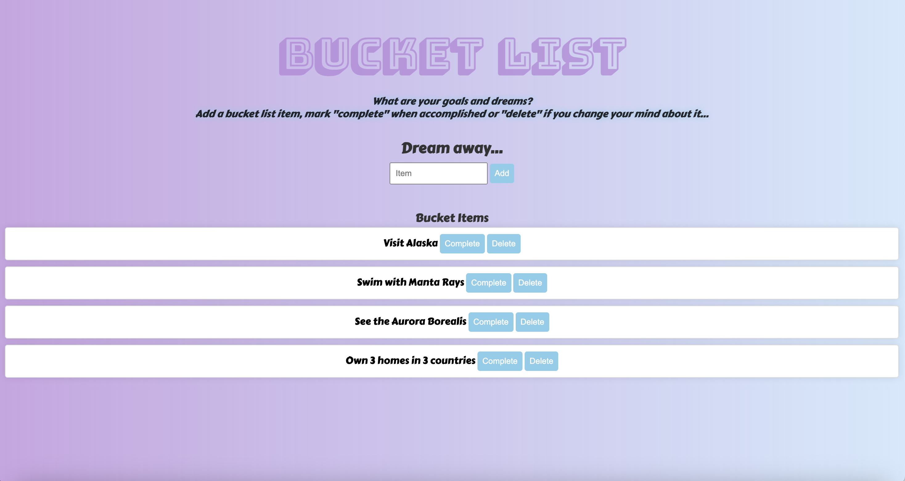

# Bucket List App
This project is a Bucket List application that allows users to add their goals and dreams, mark them as complete, and delete items from their bucket list.

 

## How It's Made:
Node.js, Express.js, MongoDB, HTML, CSS, JavaScript

# Features:
## Add Items: 
Users can add new items to their bucket list by entering the item's name and clicking the "Add" button.
## Mark as Complete: 
Each item on the bucket list can be marked as complete by clicking the "Complete" button. This action adds a line strike-through to the completed item.
## Delete Items: 
Users can remove items from their bucket list by clicking the "Delete" button associated with each item.

## Installation

1. Clone repo
2. run `npm install`

## Usage

1. run `npm run savage`
2. Navigate to `localhost:3000`
# personal-express
